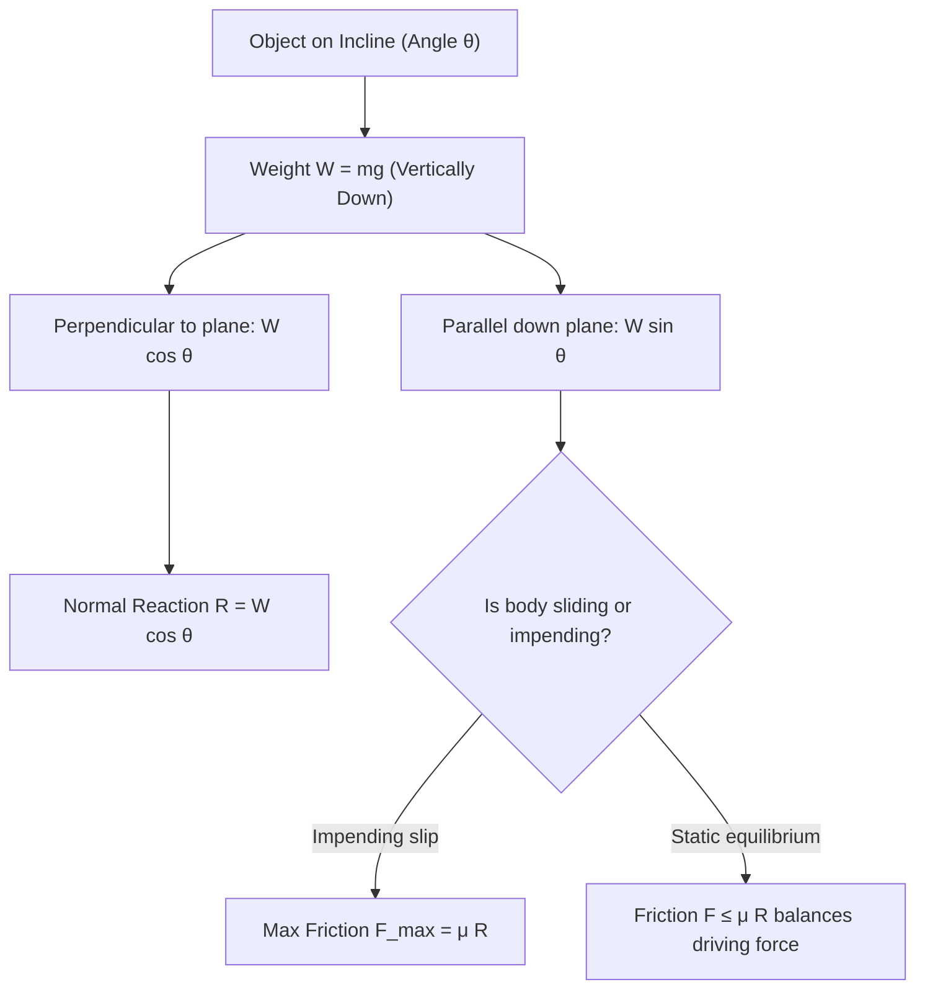

# A-Level STEM Visualization Engine

Visual representations are essential in A-Level STEM to build spatial intuition, bridge abstract equations to physical setups, and earn method marks on exam papers.

This skill provides a **hybrid approach**:
1. **Native Markdown Mermaid & Inline SVG (Primary & Zero-Dependency)**: Renders directly and instantly in Obsidian, GitHub, and markdown viewers with zero external tooling or headless browser dependencies.
2. **Subagent PNG Renderers (Optional)**: If `mermaid-maker` or `svg-maker` subagents are available, they can author and render high-resolution PNGs to the `viz/` directory.

---

## When to Visualize

Reach for a diagram whenever spatial geometry, vector direction, functional shape, or relational structure clarifies the problem:
- **Mechanics / Physics**:
  - Free-body force diagrams (resolving forces on inclined planes, pulley systems, ladder friction).
  - Wave profiles (standing waves, nodes/antinodes, interference).
  - Circuits (Kirchhoff loops, potential dividers, internal resistance).
  - Simple Harmonic Motion (phase relationships between displacement, velocity, and acceleration).
- **Pure Mathematics**:
  - Calculus: Curves $y = f(x)$, tangents, normal lines, stationary points, inflection points, and shaded integration regions $\int_a^b (f(x) - g(x))\,dx$.
  - Coordinate Geometry: Circle intersections, asymptotes, vector triangles.
- **Chemistry**:
  - Reaction enthalpy profiles (activation energy $E_a$, transition states, $\Delta H$).
  - Born-Haber cycle thermochemical diagrams.
- **Computer Science**:
  - Tree traversals (binary search trees), graph algorithms (Dijkstra), logic gate circuits.

---

## Method 1: Native Mermaid Diagrams

Use standard fenced ```mermaid blocks for flowcharts, sequences, state machines, and concept dependency maps. Obsidian renders these natively.

### Example: A-Level Mechanics Force Resolution Flowchart
````markdown

````

---

## Method 2: Native Inline SVG (Clean, Precise Geometry)

For coordinate axes, vectors, triangles, and curves, inline SVG is deterministic, lightweight, and renders natively in Obsidian.

### Example: Shaded Integration Area Under a Curve
````markdown
<svg viewBox="0 0 400 220" width="100%" height="220" xmlns="http://www.w3.org/2000/svg" style="background:#ffffff; border-radius:8px; border:1px solid #e2e8f0;">
  <!-- Axes -->
  <line x1="40" y1="180" x2="370" y2="180" stroke="#1e293b" stroke-width="2" marker-end="url(#arrow)" />
  <line x1="60" y1="200" x2="60" y2="20" stroke="#1e293b" stroke-width="2" />
  <text x="360" y="200" font-family="sans-serif" font-size="14" fill="#1e293b">x</text>
  <text x="45" y="30" font-family="sans-serif" font-size="14" fill="#1e293b">y</text>

  <!-- Shaded Area between x=1 and x=3 under curve y = 0.25*x^2 + 10 -->
  <path d="M 120,180 L 120,135 Q 200,105 280,60 L 280,180 Z" fill="#93c5fd" opacity="0.6" />

  <!-- Curve y = f(x) -->
  <path d="M 60,160 Q 200,120 340,30" fill="none" stroke="#2563eb" stroke-width="3" />
  <text x="250" y="45" font-family="sans-serif" font-size="14" font-weight="bold" fill="#2563eb">y = f(x)</text>

  <!-- Boundary limits x=a and x=b -->
  <line x1="120" y1="180" x2="120" y2="135" stroke="#475569" stroke-dasharray="4" />
  <line x1="280" y1="180" x2="280" y2="60" stroke="#475569" stroke-dasharray="4" />
  <text x="115" y="198" font-family="sans-serif" font-size="13" font-weight="bold" fill="#334155">a</text>
  <text x="275" y="198" font-family="sans-serif" font-size="13" font-weight="bold" fill="#334155">b</text>

  <!-- Area Label -->
  <text x="175" y="150" font-family="sans-serif" font-size="14" font-weight="bold" fill="#1e40af">Area = &int; y dx</text>
</svg>
````

---

## Method 3: Subagent Visual Renderers (PNG Output)

When subagents are active, you can delegate complex diagram authoring to:
- **`mermaid-maker`**: Authors structural Mermaid diagrams, renders to PNG, checks layout, and publishes to `<cwd>/viz`.
- **`svg-maker`**: Authors exact coordinate SVG plots, renders via rsvg/magick, and publishes to `<cwd>/viz`.

Embed the returned filename via Obsidian wikilink syntax:
```markdown
![[viz-mechanics-incline-12345.png|500]]
```

---

## Pedagogical Rule
Always introduce the diagram with a single explanatory sentence connecting the visual elements directly to the formula or problem statement. Do not overload diagrams with unnecessary decoration; keep them focused on the exact physical or algebraic relationship being taught.
