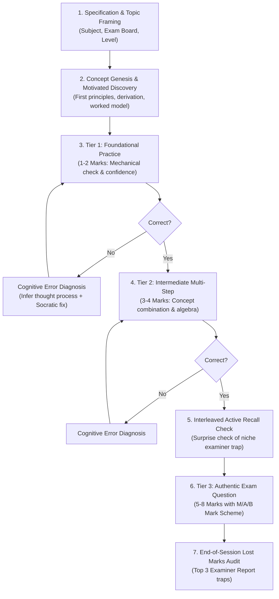

# θ (theta) — A-Level STEM Learning Harness for `pi`

A high-performance, personalized AI learning harness designed specifically for **UK A-Level STEM students** (Mathematics, Further Mathematics, Physics, Chemistry, Biology, and Computer Science across **Edexcel, OCR A, and AQA**).

Built on top of the [`pi`](https://github.com/earendil-works/pi) agent framework, `theta` transforms raw LLM interactions into a rigorous, concept-first educational engine that eliminates lost marks and prepares students for top exam grades ($A/A^*$).

---

## 🎯 Why `theta`? (Revamped from Alvar / `amos_learn`)

Traditional tutoring prompts and general-purpose tools suffer from four critical flaws when used by A-Level students:
1. **Demoralizing Cold Testing**: They begin sessions with blind quizzes before teaching the concept.
2. **Textbook Triviality**: They provide simplistic, single-step questions and assume the student has mastered the topic, leaving them unprepared for real exam papers.
3. **Superficial Error Handling**: When a student makes a mistake, they simply dump the answer or mark it red, rather than diagnosing *why* the student made that specific error.
4. **Neglect of Examiner Traps**: In real A-Level exams, students rarely lose grades on the hardest problems; they lose marks on easily forgotten definitions, unit prefix conversions, missing constants ($+C$), and calculator angle modes.

`theta` solves this with a **5-stage pedagogical pipeline**:



---

## 🧠 Core Features

### 1. Concept Genesis First (Never Cold-Tested)
Every session begins with **Direct Instruction**:
- **Why does this concept exist?** What mathematical or physical impasse forced its invention?
- **Motivated Discovery (3Blue1Brown style)**: "How could I have discovered this myself?"
- **Bedrock Unconditional Truths**: Anchored in conservation laws, axioms, or fundamental definitions.
- **Worked Model Example**: Clear, exemplary layout showing where method marks are earned before independent practice.

### 2. The 3-Tier Staged Difficulty Ladder
- **Tier 1 (Foundational Practice — 1–2 Marks)**: Direct formula application, sign check, and mechanical verification.
- **Tier 2 (Intermediate Problem Solving — 3–4 Marks)**: Multi-step synthesis requiring 2–3 reasoning leaps (combining concepts, curve intersections, resolving vectors).
- **Tier 3 (Authentic A-Level Exam Questions — 5–8+ Marks)**: Unstructured problems matching recent Edexcel, OCR A, and AQA exam papers, evaluated with official mark schemes.

### 3. Cognitive Error Remediation
When you make a mistake, `theta` infers **what you were thinking**:
- Did you drop a minus sign during integration by parts?
- Did you use SUVAT equations when acceleration was variable?
- Did your calculator evaluate trig in Degrees instead of Radians?
- Did you forget the $+C$ or miss a boundary condition?
`theta` guides you back to the exact fork where your reasoning diverged.

### 4. Interleaved Active Recall & Lost Marks Audit
- **Mid-Session Surprise Checks**: Quick 60-second recall checks of niche foundational definitions, unit prefixes ($16\text{ mm} \rightarrow 16 \times 10^{-3}\text{ m}$), and boundary cases.
- **End-of-Session Lost Marks Audit**: A targeted 3-point summary reviewing the most common pitfalls cited in official **Examiner Reports**.

### 5. Official UK Mark Scheme Engine (`quiz.ts`)
Supports two operational modes:
- **Diagnostic MCQ Mode**: Shuffled options with diagnostic distractors and an automatic **"I don't know"** choice (so honest knowledge gaps are identified rather than guessed).
- **A-Level Exam Working Mode**: Enter your final answer and key working steps. Upon submission, `quiz` renders the full **Official Mark Scheme Breakdown** (`M` for Method, `A` for Accuracy, `B` for Independent marks) for authentic self-auditing.

### 6. Obsidian Live Sync (`md-log.ts`)
Mirror your study session directly into your Obsidian vault in real time:
- Full LaTeX mathematical rendering (`$...$` and `$$...$$`).
- Beautiful Obsidian Callout boxes (`[!abstract]`, `[!question]`, `[!success]`, `[!danger]`, `[!check]`, `[!tip]`).
- Visual progression tier badges and mark scheme breakdown tables.

### 7. Hybrid Visual Engine (`visualize`)
- **Native Obsidian Mermaid & Inline SVG**: High-performance, zero-dependency diagrams (force vectors on inclines, calculus area integrals, SHM phase shifts).
- **Subagent Diagram Authors**: Autonomous agents (`mermaid-maker`, `svg-maker`) for high-resolution rendered diagrams.

---

## 🚀 System-Wide Installation & Quick Start

### 1. Global Installation (via npm)
You can install `theta` globally from anywhere using `npm`:

```bash
# From local directory:
npm install -g .

# Or from git:
npm install -g https://github.com/<your-username>/theta
```

This registers the global CLI commands **`theta-learn`** and **`learn`** (as well as `theta`).

### 2. Verify Your Setup
Run the diagnostic check from any directory to verify your configuration:
```bash
learn doctor
```

### 3. Launching a Study Session
You can launch an interactive study session in **any directory** on your machine:
```bash
# Start an interactive session
learn

# Or with an immediate topic prompt
learn "Teach me Year 2 Differentiation: Chain Rule from first principles"

# You can also pass any pi options directly
learn --model openrouter/anthropic/claude-3.5-sonnet
```

> [!NOTE]
> Installing via npm also automatically configures your global `~/.pi/agent` directory, meaning even typing `pi` in any directory will have theta's `teach` skill, `quiz` engine, and `md-log` extension available.

### 4. Mirroring Live to Obsidian
Inside your interactive session, link to your Obsidian note:
```text
/md-log "C:\Users\ry4ngupta\Documents\Obsidian\A-Levels\Calculus_Integration_By_Parts.md"
```
Every prompt, concept genesis, equation (KaTeX), quiz question, and mark scheme breakdown will immediately stream live into your Obsidian note in real time!

To stop mirroring:
```text
/md-unlog
```

---

## 📂 Directory Layout

```text
theta/
├── .pi/
│   ├── skills/
│   │   ├── teach/
│   │   │   └── SKILL.md          # Core A-Level STEM Mastery Progression engine
│   │   └── visualize/
│   │       └── SKILL.md          # Native Mermaid, inline SVG, and diagram guidelines
│   ├── extensions/
│   │   ├── quiz.ts               # A-Level Graded Assessment & M/A/B Mark Scheme Engine
│   │   ├── md-log.ts             # Obsidian Live Session Logger with Callouts & Tables
│   │   ├── ask-user-question.ts  # Interactive TUI selection & syllabus configuration
│   │   └── visual-tools/         # Subagent diagram tools & CLI renderers
│   └── agents/
│       ├── examiner.md           # Senior UK A-Level Examiner (Edexcel, OCR A, AQA)
│       ├── researcher.md         # Fast codebase & specification researcher
│       ├── mermaid-maker.md      # Autonomous Mermaid diagram author
│       └── svg-maker.md          # Autonomous SVG graphic author
├── examples/
│   ├── 01_edexcel_maths_integration_by_parts.md   # Complete Edexcel Pure Maths session
│   └── 02_ocr_physics_simple_harmonic_motion.md    # Complete OCR A Physics session
└── README.md
```

---

## 📚 Study Examples

Check out the complete worked demonstrations in `examples/`:
- [01_edexcel_maths_integration_by_parts.md](examples/01_edexcel_maths_integration_by_parts.md): Concept genesis from the Product Rule, LIATE rule, 3-tier difficulty ladder, surprise $\int \ln x \, dx$ trap check, 6-mark Edexcel exam question, and examiner report audit.
- [02_ocr_physics_simple_harmonic_motion.md](examples/02_ocr_physics_simple_harmonic_motion.md): Restoring forces to $a = -\omega^2 x$, phase shift graphs, energy conservation, degrees vs radians calculator trap, and 6-mark OCR past paper question.

---

## 🏆 Exam Board Coverage
- **Mathematics & Further Maths**: Edexcel (9MA0, 9FM0), OCR A (H240), AQA (7357).
- **Physics**: AQA (7408), OCR A (H556), Edexcel (9PH0).
- **Chemistry**: AQA (7405), OCR A (H432), Edexcel (9CH0).
- **Biology**: AQA (7402), OCR A (H420), Edexcel (9BN0).
- **Computer Science**: OCR (H446), AQA (7517).
