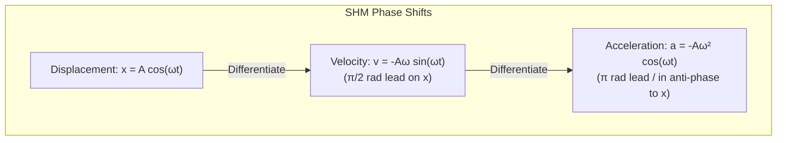

# A-Level Study Session: Simple Harmonic Motion (SHM)
**Subject**: OCR A / AQA Physics (Module 5: Newtonian World & Astrophysics)  
**Topic**: Simple Harmonic Motion — Defining Equations, Phase & Energy  
**Target Level**: Grade A / A*  

---

> [!abstract] A-LEVEL TUTOR: Concept Genesis & Motivated Discovery
> 
> ### What is Simple Harmonic Motion?
> Imagine pulling a mass attached to a spring displaced by distance $x$ from equilibrium. Hooke's Law states that the spring exerts a restoring force directly proportional to displacement, in the opposite direction:
> $$F = -kx$$
> 
> Applying Newton's Second Law ($F = ma$):
> $$ma = -kx \implies a = -\left(\frac{k}{m}\right) x$$
> 
> Since $\frac{k}{m}$ is a positive constant, we define the angular frequency $\omega$ such that $\omega^2 = \frac{k}{m}$.
> This yields the **unconditional definition of Simple Harmonic Motion**:
> $$a = -\omega^2 x$$
> 
> ### The 2 Mandatory Conditions for SHM (Examiner Definition)
> In UK exam boards (OCR A, AQA, Edexcel), whenever asked to *"Define simple harmonic motion"* (2 Marks):
> 1. **Condition 1**: Acceleration is directly proportional to displacement from the equilibrium position. ($a \propto x$) [1 Mark]
> 2. **Condition 2**: Acceleration is always directed towards the equilibrium position (indicated by the negative sign). [1 Mark]

---

### Visualizing Phase Relationships in SHM

---

> [!question] [Tier 1: Foundational Practice] (2 Marks)
> A mechanical oscillator undergoes SHM with an amplitude of $0.05\text{ m}$ and a frequency of $4.0\text{ Hz}$.
> Calculate the maximum acceleration $a_{\text{max}}$ of the oscillator to 2 significant figures.
> 
> 1. $32\text{ m}\cdot\text{s}^{-2}$
> 2. $3.2\text{ m}\cdot\text{s}^{-2}$
> 3. $5.0\text{ m}\cdot\text{s}^{-2}$
> 4. $1.3\text{ m}\cdot\text{s}^{-2}$

> [!success] [Tier 1: Foundational Practice] Quiz — Correct ✓
> **Your Answer:** 1. $32\text{ m}\cdot\text{s}^{-2}$  
> **Correct Option:** 1
> 
> **Explanation & Examiner Insights:**
> 1. Angular frequency: $\omega = 2\pi f = 2\pi(4.0) = 8\pi \approx 25.13\text{ rad}\cdot\text{s}^{-1}$.
> 2. Maximum acceleration occurs at maximum displacement ($x = A$):
>    $$a_{\text{max}} = \omega^2 A = (8\pi)^2 \times 0.05 = 64\pi^2 \times 0.05 \approx 31.58\text{ m}\cdot\text{s}^{-2} \approx 32\text{ m}\cdot\text{s}^{-2}$$
> Distractor 2 is an arithmetic power of 10 error ($3.2$ instead of $32$). Distractor 3 uses $a = \omega A$ (which is maximum velocity, not acceleration!).

---

> [!question] [Tier 2: Intermediate Problem Solving] (3 Marks)
> A particle executes SHM. At what displacement $x$ (in terms of amplitude $A$) is the kinetic energy of the particle exactly equal to its potential energy?
> 
> 1. $x = \frac{A}{\sqrt{2}}$
> 2. $x = \frac{A}{2}$
> 3. $x = \frac{A}{4}$
> 4. $x = \frac{\sqrt{3}}{2}A$

> [!success] [Tier 2: Intermediate Problem Solving] Quiz — Correct ✓
> **Your Answer:** 1. $x = \frac{A}{\sqrt{2}}$  
> **Correct Option:** 1
> 
> **Explanation & Examiner Insights:**
> The total energy $E_{\text{total}} = \frac{1}{2}m\omega^2 A^2$.
> Potential energy at displacement $x$: $E_p = \frac{1}{2}m\omega^2 x^2$.
> When $E_k = E_p$, each must equal half the total energy:
> $$E_p = \frac{1}{2}E_{\text{total}} \implies \frac{1}{2}m\omega^2 x^2 = \frac{1}{2}\left(\frac{1}{2}m\omega^2 A^2\right)$$
> Cancelling common terms: $x^2 = \frac{1}{2}A^2 \implies x = \pm \frac{A}{\sqrt{2}} \approx \pm 0.707 A$.  
> *Common Student Trap*: Guessing $x = \frac{A}{2}$ (Distractor 2). Because energy depends on the square of displacement ($E_p \propto x^2$), when $x = \frac{A}{2}$, $E_p$ is only $\frac{1}{4}$ of the total energy, not $\frac{1}{2}$!

---

> [!danger] SURPRISE ACTIVE RECALL CHECK: EXAMINER TRAP CHECKPOINT
> **Question**: If a student is evaluating $x = A \cos(\omega t)$ with $\omega = 5.0\text{ rad}\cdot\text{s}^{-1}$ and $t = 0.2\text{ s}$ on a calculator, what calculator setting causes over 30% of UK physics students to lose accuracy marks?
> 
> > [!tip] THE EXAMINER SECRET
> > **Degree Mode vs Radians Mode!**  
> > In SHM, $\omega t$ is an angle measured in **radians**, not degrees. If your calculator is in DEG mode, evaluating $\cos(5.0 \times 0.2) = \cos(1.0)$ will calculate the cosine of 1 degree ($0.9998$) rather than the cosine of 1 radian ($0.5403$).  
> > *Examiner Rule*: Calculus and SHM trigonometric arguments are ALWAYS evaluated in Radians mode.

---

> [!question] [Tier 3: Authentic A-Level Exam Question] (6 Marks)
> **OCR A Physics A — Newtonian World (Past Paper Style)**  
> A loudspeaker cone of mass $0.040\text{ kg}$ oscillates with simple harmonic motion at a frequency of $120\text{ Hz}$. The total distance travelled by the cone in one complete oscillation is $16\text{ mm}$.  
> (a) Show that the amplitude of the oscillations is $4.0\text{ mm}$. [1 Mark]  
> (b) Calculate the maximum kinetic energy of the cone. [3 Marks]  
> (c) Sketch a graph on the axes below showing how the acceleration $a$ varies with displacement $x$. State the significance of the gradient of your graph. [2 Marks]

> [!check] A-LEVEL EXAM WORKING & OFFICIAL MARK SCHEME AUDIT [Tier 3: A-Level Exam Question] (6 Marks)
> 
> **Official Mark Scheme Breakdown:**
> | Mark | Criterion | Examiner Guidance |
> | :--- | :--- | :--- |
> | **B1** | One complete cycle involves moving from $-A \rightarrow +A \rightarrow -A$, which is a total distance of $4A$.  $4A = 16\text{ mm} \implies A = 4.0\text{ mm} = 4.0 \times 10^{-3}\text{ m}$. | Must state that 1 period covers $4 \times \text{amplitude}$. |
> | **M1** | Calculates angular frequency: $\omega = 2\pi f = 2\pi(120) = 240\pi \approx 754.0\text{ rad}\cdot\text{s}^{-1}$. | Allow alternative: $v_{\text{max}} = 2\pi f A$. |
> | **M1** | Calculates maximum velocity: $v_{\text{max}} = \omega A = (754.0)(4.0 \times 10^{-3}) = 3.016\text{ m}\cdot\text{s}^{-1}$. | Power of 10 conversion from mm to m must be correct. |
> | **A1** | Correct maximum kinetic energy: $E_{k,\text{max}} = \frac{1}{2}m v_{\text{max}}^2 = \frac{1}{2}(0.040)(3.016)^2 \approx 0.18\text{ J}$ (or $0.182\text{ J}$). | 2 or 3 s.f. accepted. Units (J) required. |
> | **B1** | Straight line passing through the origin $(0,0)$ with a **negative gradient**. | Must be in quadrants 2 and 4. Positive gradient scores B0. |
> | **B1** | States that the gradient equals $-\omega^2$ (or that magnitude of gradient equals $\omega^2$ or $(2\pi f)^2$). | Stating just "frequency" or "acceleration" scores B0. |

---

> [!tip] END-OF-SESSION LOST MARKS AUDIT (OCR A Examiner Reports)
> 1. **Prefix Forgetting**: $16\text{ mm}$ must be converted to $16 \times 10^{-3}\text{ m}$ before calculating energy; forgetting this results in an answer $10^6$ times too large!
> 2. **Gradient Sign**: Drawing the $a-x$ line with a positive slope indicates the student forgot that acceleration opposes displacement ($a = -\omega^2 x$).
> 3. **The 4A Distance**: Forgetting that one cycle is $4A$ (from center to peak, peak back to center, center to trough, trough back to center).
